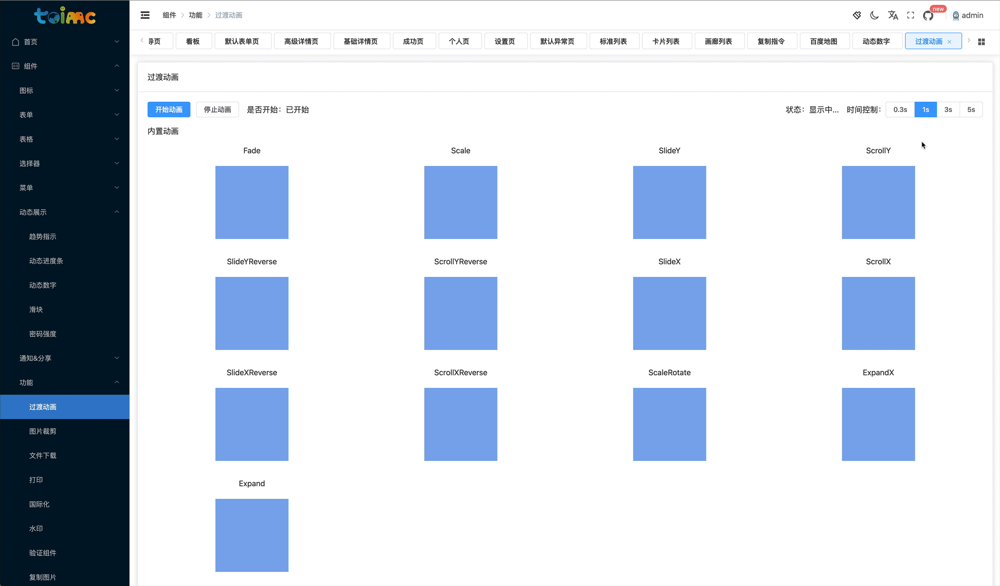

# 过渡动画

有两个基础组件：`ExpandTransition.vue`和`SimpleTransition.vue`，全局的css样式在`src/assets/style/transitions.scss`，基本的原理使用的是插槽。


## 效果




## 基础用法

```vue
<simple-transition name="expand-x-transition" mode="in-out" delay="1.0s">
	<slot></slot>
</simple-transition>

<expand-transition :x="true">
	<slot></slot>
</expand-transition>
```


## 基础属性

```js
props: {
  name: {
    type: String,
    default: ''
  },
  group: {
    type: Boolean as PropType<boolean>,
    default: false
  },
  mode: {
    type: String as PropType<Mode>,
    default: 'in-out'
  },
  origin: {
    type: String as PropType<string>,
    default: 'top center 0'
  },
  delay: {
    type: [String, Number],
    default: '0.3s'
  },
  timingFunction: {
    type: String,
    default: 'cubic-bezier(0.25, 0.8, 0.5, 1)'
  }
},
```

其中，支持的名称，格式为`[动画名称]-transition`，例如：`fade-transition`，可以使用工具类`toLine`方法来进行转换。

```typescript
import { TransitionNameEnum } from '@/enums/menuEnum'

// 使用Enum
console.log(TransitionNameEnum.Fade)
```


## [扩展]动画列表组件

使用`component`动态组件，扩展基础动画组件用法：

```vue
<template>
  <component
    :is="/Expand/.test(name) ? 'expand-transition' : 'simple-transition'"
    :name="toLine(name + 'Transition')"
    :x="name === 'ExpandX'"
    :delay="delay"
    v-bind="$attrs"
  >
    <slot></slot>
  </component>
</template>

<script lang="ts">
  import { toLine } from '@/utils'
  import { defineComponent, PropType } from 'vue'
  import { TransitionList } from './types'
  import SimpleTransition from './SimpleTransition.vue'
  import ExpandTransition from './ExpandTransition.vue'

  export default defineComponent({
    components: {
      SimpleTransition,
      ExpandTransition
    },
    props: {
      name: {
        type: String as PropType<TransitionList>,
        default: ''
      },
      delay: {
        type: [String, Number],
        default: '0.3s'
      }
    },
    setup() {
      return {
        toLine
      }
    }
  })
</script>

<style scoped></style>
```


支持的所有的动画：

```typescript
export type TransitionList =
  | 'Fade'
  | 'Scale'
  | 'SlideY'
  | 'ScrollY'
  | 'SlideYReverse'
  | 'ScrollYReverse'
  | 'SlideX'
  | 'ScrollX'
  | 'SlideXReverse'
  | 'ScrollXReverse'
  | 'ScaleRotate'
  | 'ExpandX'
  | 'Expand'
```


